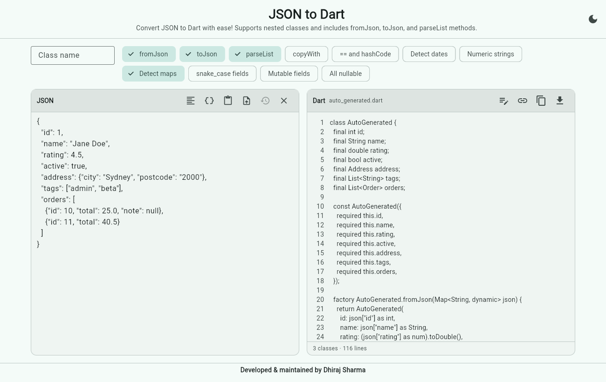
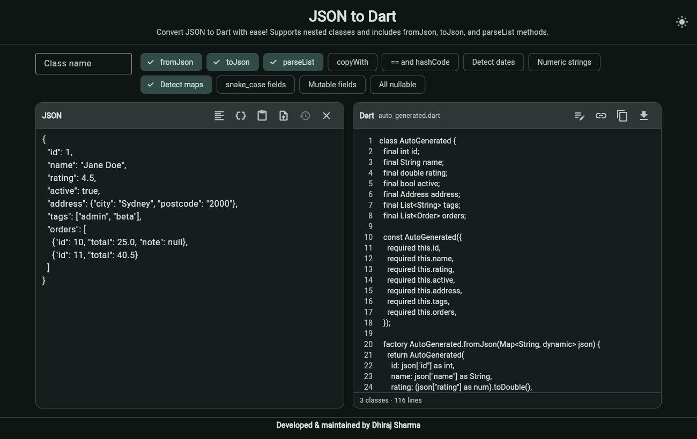

# JSON to Dart

A Flutter web app that turns JSON into Dart classes. Paste JSON, pick the options you want, and copy or download the result.

Try it at [JSON to Dart Converter](https://sharmadhiraj.github.io/json-to-dart/).

| Light | Dark |
| --- | --- |
|  |  |

## Features

- Nested objects, lists of objects and lists of lists, with one class per object.
- Several objects in a list (or a root array) are merged into one class. Keys that are missing in some of them become nullable, and `int` mixed with `double` becomes `double`.
- Number literals are read as written, so `10.0` is a `double` even though the browser cannot tell `10` and `10.0` apart.
- Dynamic-key objects such as `{"2024-01": {...}, "2024-02": {...}}` become `Map<String, T>`. An empty object becomes `Map<String, dynamic>`.
- Helpful errors with line and column for invalid JSON.
- Rename any generated class, and see exactly what each one was generated as.
- Remembers your input and options, keeps a list of recent inputs, and can share a result as a link.
- Format, paste, upload or drag and drop a `.json` file, and a built-in sample.
- Light and dark theme, keyboard shortcuts, and a layout that works on narrow screens.

## Options

| Option | Effect |
| --- | --- |
| `fromJson` / `toJson` | Generate `factory X.fromJson(...)` and `Map<String, dynamic> toJson()`. |
| `parseList` | Generate `static List<X> parseList(dynamic list)`. Needs `fromJson`. |
| `copyWith` | Generate a `copyWith` method. |
| `== and hashCode` | Generate value equality. Lists and maps use `DeepCollectionEquality` from `package:collection`. |
| Detect dates | ISO 8601 strings become `DateTime`. |
| Numeric strings | Strings such as `"42"` and `"12.50"` become `int` and `double` (leading zeros and very long digit runs stay strings). |
| Detect maps | Treat objects whose keys look like ids, numbers, dates or UUIDs as `Map<String, T>`. |
| snake_case fields | Keep `user_name` instead of `userName`. |
| Mutable fields | Drop `final` and `const`. |
| All nullable | Make every field nullable and optional. |

Reserved words and invalid names are fixed up (`class` becomes `classValue`), and clashing names get a numeric suffix.

## Keyboard shortcuts

| Shortcut | Action |
| --- | --- |
| Ctrl/Cmd + Enter | Copy the generated code |
| Ctrl/Cmd + S | Download the `.dart` file |
| Ctrl/Cmd + Shift + F | Format the JSON |

## Large inputs

Above about 300 KB the text editor is replaced by a read-only preview, because laying out that much text in the browser makes the page stall. Generation itself stays fast (roughly 1 second for a 5 MB paste). Inputs over 1 MB are not saved between visits, and over 8,000 encoded characters they cannot be shared as a link.

## Development

```
flutter pub get
flutter analyze
flutter test                      # generator, controller and golden tests
flutter test --platform chrome    # also runs test/screen_test.dart
flutter run -d chrome
```

The generator in `lib/generator` is plain Dart with no web dependencies. The golden files in `test/golden` hold the expected output, and the same tests run `dart analyze` on the generated code. After an intended output change:

```
UPDATE_GOLDENS=1 flutter test test/generated_code_test.dart
```

## Build

The site is served from a sub-path, so pass the base href:

```
flutter build web --release --output docs --base-href /json-to-dart/
```

## Feedback

Your reviews and suggestions are welcome! Share feedback to improve the tool.
